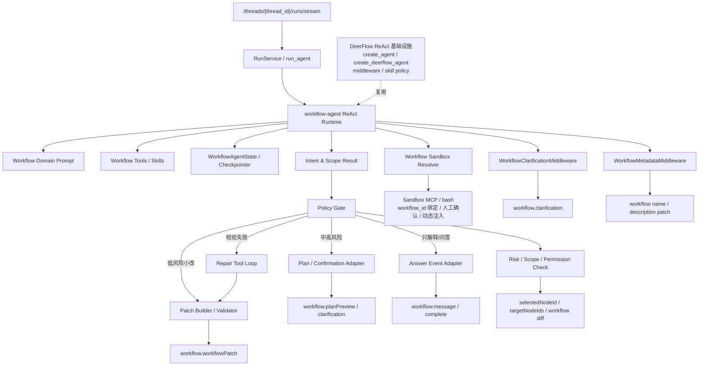

# Workflow Agent 领域 ReAct 改造 TODO

## 目标

- 将 workflow-agent 从“固定建流流程 Agent”升级为“工作流领域 ReAct Agent”。
- 复用 ReAct 的灵活规划能力，让模型根据用户场景自主选择 Tool/Skill 处理需求。
- 将工作流能力拆成可组合 Tool/Skill，而不是把“从 0 到 1 搭建完整工作流”写死成唯一流程。
- 保留 workflow-agent 的领域安全边界：Scope、Risk、Patch Schema、画布校验、预览态、用户确认和稳定事件协议。
- 将跨 Run 的业务上下文迁入 LangGraph state/checkpointer，减少对进程内 `_sessions` 的依赖。
- 保持 `/api/threads/{thread_id}/runs/stream`、`assistant_id: "workflow-agent"` 和现有 `workflow.*` 事件兼容。

## 核心判断

`lead_agent` 的 ReAct 模式可以解决灵活性问题，但不建议直接把 workflow-agent 变成同一个 `lead_agent`。

更合理的关系是：

```text
lead_agent
  通用 ReAct Agent，面向开放任务。

workflow-agent
  工作流领域 ReAct Agent，复用 ReAct runtime，但装配工作流专属 Prompt、Tool、Skill、状态、策略门禁和事件适配。
```

用户场景不固定，可能是：

```text
从 0 创建完整工作流
修改已有工作流
只调整当前选中节点
插入一个节点
重连局部流程
优化提示词
修复校验错误
解释当前画布
检查工作流风险
调试代码节点
```

这些场景不应该靠大量 `if/else` 写死，而应该由模型在受控边界内规划和调用能力。

## 非目标

- 不把 workflow-agent 直接替换成开放的 `lead_agent`。
- 不把“完整新建工作流”作为唯一固定流程。
- 不允许模型绕过策略门禁直接修改画布。
- 不允许低风险和高风险操作使用同一套确认策略。
- 不在 checkpoint 中持久化图片、视频、base64、完整文件或工具大结果。
- 不恢复已删除的工作流专属流式接口或 `app/workflow/assistant` 兼容模块。

## 目标架构



## 设计原则

### 1. 模型负责场景规划，系统负责边界

模型可以判断用户意图和选择工具：

```text
create_workflow
modify_workflow
modify_selected_node
insert_node
remove_node
rewire_edges
optimize_node
fix_validation
explain_workflow
debug_node
```

系统必须校验模型的计划和结果：

```text
scope 是否越界
risk 是否需要确认
Patch 是否符合 Schema
Patch 是否满足最小修改
是否影响 selectedNodeId 之外的节点
是否通过服务端和前端校验
```

### 2. 确认流程按风险触发，不固定套所有场景

```text
低风险
  例如只改选中 LLM 节点提示词。
  可直接生成 Patch 预览，或一键应用。

中风险
  例如插入节点、修改局部连线、调整多个节点配置。
  需要简短变更说明和用户确认。

高风险
  例如从 0 新建完整工作流、删除节点、重写主流程、批量重连。
  需要完整 planPreview、Mermaid、阶段拆分和用户确认。
```

### 3. 工具/Skill 是能力单元，不是固定流程步骤

能力应被拆成小而清晰的 Tool/Skill：

```text
describe_workflow
inspect_node
classify_workflow_intent
plan_workflow_change
build_workflow_patch
validate_workflow_patch
repair_workflow_patch
run_node_skill
validate_python_node_code
summarize_workflow_change
```

ReAct 根据当前上下文选择工具组合，而不是强制走固定顺序。

### 4. Checkpoint 只保存可恢复的小状态

建议的 LangGraph state：

```python
class WorkflowAgentState(TypedDict, total=False):
    messages: Annotated[list[AnyMessage], add_messages]
    workflow_assistant: dict[str, Any]
    workflow_context: dict[str, Any] | None
    sandbox_context: dict[str, Any] | None
    current_intent: dict[str, Any] | None
    current_plan: dict[str, Any] | None
    current_patch: dict[str, Any] | None
    pending_clarification: dict[str, Any] | None
    workflow_metadata: dict[str, Any] | None
    policy_result: dict[str, Any] | None
    validation_result: dict[str, Any] | None
    error: dict[str, Any] | None
```

`workflow_context` 建议只保存：

```text
thread_id
request_summary
selected_node_id
target_node_ids
last_intent
last_scope
last_risk_level
pending_confirmation
repair_attempts
sandbox_id
sandbox_binding_status
pending_clarification
workflow_name
workflow_description
```

当前画布优先使用本轮请求中的 `workflow`；大对象进入 artifact/object store，state 只保存 ID、摘要和必要元数据。

### 5. 复用 lead_agent 的基础设施，不复用开放行为

可复用：

```text
create_agent / create_deerflow_agent
create_chat_model
RuntimeFeatures
通用错误处理 middleware
ToolErrorHandlingMiddleware
LLMErrorHandlingMiddleware
DanglingToolCallMiddleware
LoopDetectionMiddleware
SummarizationMiddleware
SandboxMiddleware
Skill prompt section
filter_tools_by_skill_allowed_tools
```

不可直接复用：

```text
lead_agent 的完整 system prompt
lead_agent 的全量工具集合
lead_agent 的开放输出协议
lead_agent 的默认 ThreadState
lead_agent 面向开放任务的默认 bash / MCP / ACP / update_agent 装配方式
```

workflow-agent 应该使用专属：

```text
WorkflowAgentState
Workflow domain prompt
Workflow tools whitelist
Workflow Skill whitelist
Workflow Policy Gate
workflow.* event adapter
WorkflowClarificationMiddleware
WorkflowMetadataMiddleware
WorkflowSandboxResolver
```

### 6. 沙箱能力允许暴露，但必须绑定到 workflow 上下文

workflow-agent 可以暴露沙箱中的 MCP/bash 能力，但不能按 lead_agent 的开放方式默认暴露给所有会话。

沙箱能力必须满足：

```text
1. 沙箱按 workflow_id 绑定；thread_id 只表示一次对话上下文，不作为沙箱长期归属。
2. 如果当前画布没有绑定沙箱，必须触发 bind/create sandbox 人工确认流程。
3. 用户确认前，不允许模型自动创建或绑定沙箱。
4. 沙箱绑定完成后，才动态注入 sandbox MCP/bash tools。
5. 所有 sandbox MCP/bash 调用必须经过 WorkflowPolicyGate、Guardrail 或 SandboxAudit 审计。
6. ToolMessage 不返回大文件、base64、完整日志，统一返回摘要和 artifact_id。
7. bash 是否默认允许必须配置化，不能在代码中硬编码。
```

推荐链路：

```text
模型判断需要代码执行 / 代码节点调试 / 依赖安装
  -> WorkflowSandboxResolver 按 workflow_id 检查是否已有 sandbox_id
  -> 无 sandbox_id：输出 workflow.sandboxRequired，等待人工绑定或创建
  -> 有 sandbox_id：动态注入 sandbox MCP/bash 能力
  -> 执行 sandbox tool
  -> SandboxAudit / PolicyGate 记录和校验
```

这意味着：

```text
普通画布解释、提示词修改、连线调整
  不需要沙箱，也不注入 MCP/bash。

代码节点生成、代码节点调试、节点 Skill 执行
  可以启用沙箱 MCP/bash，但必须处于已绑定沙箱的画布上下文中。
```

sandbox MCP/bash 的暴露粒度分两阶段：

```text
第一阶段
  只暴露统一代理工具 execute_sandbox_mcp_tool。
  模型传入 tool_name、args、risk_hint，由后端在绑定沙箱中路由真实 MCP/bash。
  好处是 PolicyGate、审计、超时、输出截断和 artifact 化都集中。

第二阶段
  在沙箱绑定完成后，将真实 MCP tools 动态展开给模型。
  仍需要保留统一审计、权限和输出治理。
```

依赖安装原则：

```text
1. 优先使用当前沙箱已有依赖和运行环境。
2. 只有无法完成代码节点校验或执行时，才允许规划 install_dependency。
3. install_dependency 默认为中风险，需要用户确认或策略显式允许。
4. 依赖安装后需要记录 sandbox environment snapshot。
5. 切换沙箱或复制工作流时，应优先复制/恢复该 environment snapshot。
6. 如果无法复制环境，必须提示用户重新绑定或重新安装依赖。
```

文件写入原则：

```text
write_file 不需要单独风险确认，但必须限定在当前 workflow_id 绑定沙箱的工作目录内。
禁止跨工作目录写入、写系统路径、写隐藏凭证路径。
```

后续批量调用扩展预留：

```text
当前阶段不实现批量调用。

workflow_id 绑定的是 base sandbox / 开发调试沙箱。
未来批量调用时，不应默认所有调用共享 base sandbox。

建议扩展模型：
  workflow_id -> base_sandbox_id
  batch_id -> sandbox pool
  invocation_id -> execution sandbox / sandbox lease

execution sandbox 从 base sandbox 或 environment snapshot 派生。
创建数量由批量调用隔离策略决定：
  shared         整个 batch 共享一个 execution sandbox
  pool           按并发度创建 N 个 execution sandbox
  per_invocation 每次调用一个 execution sandbox

当前 TODO 只要求记录 environment snapshot 和 sandbox 归属信息，
为后续 batch_id / invocation_id 扩展预留字段和测试，不实现批量调度。
```

## 分阶段 TODO

### 阶段 0：基线、场景和边界固化

- [x] 记录现有 `workflow.*` 事件名称、payload 和前端消费行为，形成兼容性清单。
- [ ] 补充当前 workflow-agent 基线测试，覆盖规划、澄清、确认、阶段生成、修复、取消和完成。
- [x] 梳理真实用户场景集：新建、局部修改、选中节点修改、插入节点、删除节点、重连、修复、解释、调试。
- [x] 将“从 0 到 1 创建完整工作流”标记为高风险场景之一，而不是默认唯一流程。
- [x] 明确 ReAct 实现基座：优先复用 `langchain.agents.create_agent` 或现有 `lead_agent` 的底层创建模式。
- [x] 明确 workflow-agent 不能复用 `lead_agent` 的开放工具边界和通用输出协议。
- [ ] 定义 checkpoint 单条 state 大小上限、messages 保留策略和旧 checkpoint 清理策略。
- [ ] 确认重构期间使用 feature flag 或双 factory 灰度，避免一次性切换。

### 阶段 1：意图、Scope 和 Risk Schema

- [x] 新增 `WorkflowIntent` Schema，覆盖 create、modify、modify selected node、insert、remove、rewire、optimize、fix、explain、debug。
- [x] 新增 `WorkflowChangeScope` Schema，至少包含 `full_workflow`、`partial_workflow`、`selected_node_only`、`target_nodes`、`read_only`。
- [x] 新增 `WorkflowRiskLevel` Schema，至少包含 `low`、`medium`、`high`。
- [x] 新增 `WorkflowPolicyDecision` Schema，描述是否允许执行、是否需要确认、允许的操作类型和禁止原因。
- [x] 新增 `WorkflowActionPlan` Schema，用于模型输出结构化意图、范围、目标节点、风险和建议工具链。
- [x] 明确 `selectedNodeId` 存在时的默认策略：除非用户明确要求全局修改，否则优先按局部或选中节点修改处理。
- [x] 对 `read_only` 场景要求只输出解释，不生成 Patch。

### 阶段 2：工具和 Skill 能力拆分

- [x] 盘点现有 `describe_workflow`、`build_workflow_patch`、`validate_workflow_patch`、`run_node_skill`、`validate_python_node_code` 的真实实现和注册位置。
- [x] 实现或补齐 `inspect_node`，用于读取单个节点配置、输入输出、依赖和能力。
- [ ] 实现或补齐 `classify_workflow_intent`，将自然语言需求转成结构化 intent/scope/risk 草案。
- [ ] 实现或补齐 `plan_workflow_change`，生成适用于任意修改场景的变更计划。
- [ ] 实现或补齐 `repair_workflow_patch`，根据服务端或前端 validation 错误修复 Patch。
- [ ] 实现或补齐 `summarize_workflow_change`，将 Patch 转成用户可读变更说明。
- [x] 将节点专属生成能力沉淀到 `run_node_skill`，支持 LLM、selector、loop、code、end 等节点类型。
- [x] 所有 Tool 输入输出必须有 Pydantic Schema。
- [x] Tool 输出限制体积，递归移除 base64，超限结果只返回有界预览、原始长度和 SHA-256。
- [ ] 大结果写入 artifact/object store，ToolMessage 只返回摘要和 `artifact_id`。
- [ ] 外部有副作用的 Tool 增加幂等键，建议使用 `thread_id + run_id + operation_id`。
- [x] 新增 `resolve_workflow_sandbox`，根据 workflow_id 查询当前工作流沙箱绑定。
- [x] 新增 `request_workflow_sandbox_binding`，当 workflow_id 未绑定沙箱时输出 `workflow.sandboxRequired`，不允许模型自动创建。
- [ ] 新增 `list_sandbox_capabilities`，在沙箱绑定完成后返回可用 MCP/bash 能力摘要。
- [ ] 新增 `execute_sandbox_mcp_tool` 统一代理工具，在当前 workflow_id 绑定沙箱内执行 MCP/bash 能力。
- [ ] 支持后续将真实 MCP tools 动态展开给模型，但必须保留统一策略、审计、超时和输出治理。
- [ ] 新增 sandbox 环境查询能力，优先使用已有依赖和当前运行环境。
- [ ] 新增 dependency plan 能力，只有环境无法满足时才规划 `install_dependency`。
- [ ] 新增 sandbox environment snapshot 记录，用于切换沙箱或复制工作流时恢复依赖环境，并为后续批量调用预留恢复依据。
- [x] 当前 `run_node_skill` 沙箱工具输出经过统一治理，禁止把完整大结果或 base64 写入 messages。

### 阶段 3：领域 ReAct Agent 装配

- [x] 新增 workflow-agent 专属 ReAct factory，优先复用 `create_deerflow_agent()` 或 `create_agent()` 能力。
- [x] 明确不直接调用 `make_lead_agent()`，避免继承 lead_agent 的开放工具边界和通用 Prompt。
- [x] 复用 `create_chat_model()` 解析模型、`thinking_enabled`、`reasoning_effort` 和默认模型配置。
- [ ] 复用 `RuntimeFeatures` 的声明式装配方式，构造 workflow-agent 专属 middleware/features 配置。
- [x] 默认启用 `ToolErrorHandlingMiddleware`、`LLMErrorHandlingMiddleware`、`DanglingToolCallMiddleware` 和 `LoopDetectionMiddleware`。
- [x] 接入 `SummarizationMiddleware`，按 messages/tokens 阈值压缩历史，只裁剪 `messages` 并保留 workflow 结构化状态。
- [x] 接入 `TokenUsageMiddleware`，按 `token_usage.enabled` 配置记录模型用量和步骤归因。
- [x] 新增 `WorkflowClarificationMiddleware`，拦截 workflow 澄清请求并输出 `workflow.clarification`。
- [x] 新增 `WorkflowMetadataMiddleware`，在新建或重命名场景生成 workflow `name` 和 `description`。
- [x] 新增 `WorkflowSandboxMiddleware`，按 workflow_id 校验人工绑定并注入绑定 sandbox state，禁止按 thread 自动申请替代沙箱。
- [ ] 支持 workflow_id 绑定沙箱完成后动态注入 sandbox MCP/bash tools。
- [ ] bash 是否默认允许必须从配置读取，例如 `workflow_agent.sandbox.bash_enabled`，禁止硬编码。
- [ ] 不启用 `SubagentLimitMiddleware`、`ViewImageMiddleware`、`MemoryMiddleware`；`TitleMiddleware` 仅用于 thread 标题，不负责 workflow name/description。
- [x] 复用 Skill prompt 注入机制，但只注入 workflow-agent 白名单 Skill。
- [x] workflow-agent Skill 容器路径按 workflow_id 解析为 `/workflows/{workflow_id}/skills`，与通用 lead_agent 的全局 `/mnt/skills` 解耦。
- [x] 复用 `filter_tools_by_skill_allowed_tools()`，根据 workflow Skill 限制可见 Tool。
- [x] 为 workflow-agent 配置领域系统 Prompt，说明当前画布、选中节点、Patch 规则、风险策略和工具边界。
- [ ] 为 workflow-agent 装配分层工具白名单：默认 workflow tools；绑定 workflow_id 沙箱后允许 sandbox-scoped MCP/bash tools。
- [x] 禁止默认加载 lead_agent 的全量 `get_available_tools()`，workflow-agent 工具集合由专属 registry 显式声明。
- [ ] 如需 MCP/bash/ACP/子 Agent 能力，必须先经过 workflow-agent policy 配置显式开启；其中 MCP/bash 还必须绑定 workflow_id 沙箱。
- [x] 将模型最终输出约束为结构化结果：answer、intent、plan、patch、clarification 或 error。
- [x] ReAct 内部模型和工具事件默认不直接透传前端，统一交给事件适配层。
- [x] 设置最大工具循环检测、最大修复次数和 Run timeout。
- [x] 设置 workflow-agent 独立单次输出 token 上限，并支持配置为 `null` 回退到模型自身限制。
- [x] 对工具调用循环失败、结构化输出失败、策略拒绝分别返回明确错误。
- [x] 增加装配快照测试，确认 workflow-agent 最终暴露的 Tool、Skill、middleware 符合白名单。

### 阶段 4：策略门禁 Policy Gate

- [x] 实现 `WorkflowPolicyGate`，接收 intent、scope、risk、selectedNodeId、targetNodeIds 和候选 Patch。
- [x] `read_only` 场景禁止生成 Patch。
- [x] `selected_node_only` 场景禁止修改目标节点外的节点和边。
- [x] `partial_workflow` 场景要求 targetNodeIds 或影响范围明确。
- [x] `full_workflow` 场景默认要求 planPreview 和用户确认。
- [x] 删除节点、批量重连、全局重写等操作默认要求确认。
- [x] 低风险小修改可直接返回 Patch 预览。
- [x] 中高风险修改必须返回确认事件，确认后才能生成最终 Patch。
- [x] 策略拒绝时返回结构化原因。
- [x] 当前已注册的沙箱工具调用必须校验 workflow_id 绑定，否则输出 `workflow.sandboxRequired`。
- [x] 当前已注册的沙箱工具调用按 workflow_id 查询 sandbox_id 归属关系，禁止按 thread 自动申请替代沙箱。
- [ ] 对 bash 命令增加配置化开关、allowlist/denylist、超时、输出大小限制和审计要求。
- [ ] `install_dependency` 优先检查现有环境；确需安装时默认中风险确认，并写入 sandbox environment snapshot。
- [ ] `write_file` 不要求风险确认，但必须限制在当前 workflow_id 绑定沙箱的工作目录内。
- [x] workflow name/description 生成只能产生 metadata patch，不能改动节点和边。
- [ ] 所有策略判断记录简洁日志，只记录 intent、scope、risk、count、success、costMs。

### 阶段 5：Patch 构建、校验和修复

- [x] Patch 必须通过 `build_workflow_patch()` 规范化。
- [x] Patch 必须通过 `require_valid_workflow_patch()` 服务端硬校验。
- [x] Patch 必须通过 Policy Gate 的 scope 校验。
- [x] 前端 `validateWorkflowGraph()` 返回的 `validation_failed` 继续触发修复。
- [ ] 服务端校验失败时，将结构化错误写入 `validation_result`，再交给 ReAct 修复。
- [ ] 统一 Error/Warning 两级模型：Error 阻断，Warning 随 Patch 返回但不阻断。
- [x] 最大修复次数达到后转入失败态，并保留当前上下文供用户修订需求。
- [x] 对指定节点修改增加最小 Patch 测试，禁止重写整张画布。

### 阶段 6：Checkpointer 和上下文持久化

- [x] `WorkflowAgentState` 只持久化 `messages`、`workflowContext`、`workflowTask`、metadata 去重和错误状态；最终输出与策略结果由 return tools 同步校验并发出，不写入 checkpoint。
- [x] 将当前 `WorkflowAgentOrchestrator._sessions` 中的跨 Run 状态迁入 LangGraph state。
- [x] 验证同一 `thread_id` 的后续 Run 自动恢复最新 checkpoint。
- [ ] 验证不同 `thread_id` 之间状态完全隔离。
- [ ] 配置 PostgreSQL checkpointer 作为多实例生产方案。
- [ ] checkpoint 禁止写入图片、视频、base64、文件正文和完整工具大结果。
- [x] 实现 messages 裁剪或摘要，只保留近期决策上下文。
- [x] 完整用户消息、模型消息和工具事件继续由 `RunJournal/run_event_store` 负责历史与审计。
- [ ] 设计旧 checkpoint 的 TTL/保留数量清理任务。
- [ ] 明确 rollback 只回滚 LangGraph state，不承诺回滚外部 Tool 副作用。

### 阶段 7：事件适配和前端兼容

- [x] 保持请求入口 `/api/threads/{thread_id}/runs/stream` 不变。
- [x] 保持请求体 `assistant_id: "workflow-agent"` 不变。
- [x] 保持现有 client event：`user_message`、`revise_plan`、`confirm_plan`、`stage_validated`、`validation_failed`、`cancel_plan`。
- [x] 继续输出 `workflow.session`、`workflow.message`、`workflow.clarification`、`workflow.planPreview`、`workflow.patchStage`、`workflow.workflowPatch`、`workflow.fixing`、`workflow.complete`、`workflow.error`、`workflow.end`。
- [x] 新增 `workflow.sandboxRequired` 表达 workflow_id 未绑定沙箱时的人工绑定/创建请求。
- [x] 复用 `workflow.workflowPatch` 表达 workflow name/description 生成结果，新增 `update_metadata` operation。
- [x] 新增或复用事件时保证旧前端可忽略未知字段。
- [x] 对低风险小修改支持更轻量的变更说明和 Patch 预览。
- [x] 对中高风险修改继续展示 planPreview、Mermaid、阶段或影响范围。
- [x] 前端支持 `workflow.sandboxRequired` 展示、人工绑定/创建沙箱，并在确认后携带 workflow_id、sandbox_id、sandbox_binding_status 重新进入 workflow-agent。
- [x] 前端支持展示并应用 workflow name/description 的 metadata patch。
- [ ] 历史恢复优先读取持久化 custom 事件和 checkpoint 摘要，不依赖进程内 session。
- [ ] 验证刷新页面、切换历史线程、跨设备打开时计划卡片、Patch 和上下文可恢复。

### 阶段 8：多实例和运行控制

- [ ] 明确 `RunManager._runs` 仅保存当前实例活跃 Task，完成后延迟清理。
- [ ] 将 Run 元数据和状态接入持久化 `RunStore`。
- [ ] 多实例并发控制使用数据库事务或分布式锁，不能只检查本地 `_runs`。
- [ ] 为 Run 增加 `owner_instance_id`、heartbeat 和 `cancel_requested` 等控制信息。
- [ ] 设计跨实例取消信号，由持有本地 `asyncio.Task` 的 owner 实例执行取消。
- [ ] 将 `MemoryStreamBridge` 替换或扩展为共享 StreamBridge，支持 SSE 跨实例订阅与重连。
- [ ] 在分布式能力未完成前，部署文档明确单实例或 sticky routing 限制。

### 阶段 9：测试场景矩阵

- [x] 新建完整工作流：高风险，必须 planPreview + 确认。
- [ ] 已有工作流局部新增节点：中风险，要求影响范围明确。
- [x] 只修改选中 LLM 节点提示词：低风险，Patch 只能触达该节点。
- [ ] 只修改选中 selector 条件：低风险或中风险，Patch 只能触达该节点和必要端口配置。
- [ ] 插入代码节点并生成代码：中风险，必须调用代码校验。
- [ ] 删除节点或重连主链路：高风险，必须确认。
- [ ] 修复前端 validation 错误：进入 repair 流程，受最大修复次数限制。
- [x] 解释当前工作流：read_only，不允许产生 Patch。
- [ ] 用户需求含糊或目标节点不明确：返回 clarification。
- [x] 模型调用 workflow 澄清：`WorkflowClarificationMiddleware` 输出结构化 `workflow.clarification`。
- [x] 新建工作流且缺少名称/描述：`WorkflowMetadataMiddleware` 生成 metadata patch。
- [ ] 已有工作流已有名称/描述：默认不覆盖，除非用户明确要求重命名或改描述。
- [x] 代码节点调试但 workflow_id 未绑定沙箱：返回 `workflow.sandboxRequired`，不执行当前已注册的沙箱工具。
- [ ] 画布已绑定沙箱后调试代码节点：允许动态注入 sandbox MCP/bash 并执行。
- [ ] 依赖缺失但可用已有环境替代：优先使用已有环境，不安装依赖。
- [ ] 确需安装依赖：要求用户确认，安装后记录 environment snapshot。
- [ ] 切换沙箱或复制工作流：优先复制/恢复 environment snapshot。
- [ ] 后续批量调用预留：environment snapshot 可作为 execution sandbox 派生依据，但当前不实现批量调度。
- [ ] write_file 写当前工作目录：不需要风险确认；写越界路径：Policy Gate 阻断。
- [ ] sandbox MCP/bash 输出过大：写 artifact，只返回摘要和 artifact_id。
- [x] 用户要求越权修改 selectedNodeId 之外内容：Policy Gate 阻断或要求确认。
- [ ] 两个 thread 并发执行：状态不串线。
- [ ] 服务重启后继续同一 thread：从 checkpoint 恢复上下文。
- [ ] 多实例下 SSE 重连、取消和并发策略行为符合预期。

### 阶段 10：回归与验证

- [x] 单元测试：intent/scope/risk Schema 和策略门禁矩阵。
- [x] 单元测试：Tool 输出的结构保持、base64 移除和超限截断。
- [ ] 单元测试：Patch 最小修改、规范化、Error/Warning 和修复次数上限。
- [ ] 单元测试：WorkflowAgentState reducer 和上下文序列化。
- [x] 单元/集成测试：`WorkflowClarificationMiddleware` 的 Tool 拦截、state 写入和结构化事件适配。
- [x] 单元/集成测试：`WorkflowMetadataMiddleware` 只生成 metadata patch，不修改节点和边。
- [ ] 单元测试：`WorkflowSandboxResolver` 的未绑定、已绑定、跨 workflow 拒绝和动态工具注入。
- [ ] 单元测试：sandbox MCP/bash 的配置化开关、命令审计、超时和输出截断。
- [ ] 单元测试：dependency plan、environment snapshot 记录和恢复。
- [ ] 单元测试：write_file 工作目录限制和越界阻断。
- [x] 集成测试：ReAct 结构化最终输出和事件适配链路。
- [x] 集成测试：同一 thread 多个 Run 恢复上下文。
- [ ] 集成测试：服务重启后从 PostgreSQL checkpoint 恢复。
- [ ] 回归测试：历史侧栏、重命名、删除、导出和 workflow-agent 过滤。
- [ ] 前端 TypeScript 构建和浏览器联调。

### 阶段 11：迁移与清理

- [ ] 增加新旧 workflow-agent factory 的 feature flag。
- [ ] 在测试环境对相同输入执行新旧链路，比较事件、Patch、校验结果和用户体验。
- [ ] 灰度期间记录成功率、平均模型轮次、Tool 调用次数、checkpoint 大小、修复成功率和延迟。
- [x] 切换 `WORKFLOW_AGENT_DEFINITION.runtime.kind` 为 `react_agent` 并保留统一 factory 入口。
- [x] 删除旧 `_sessions`、旧 Orchestrator 状态管理和不再使用的直接 LLM 调用代码。
- [x] 不引入旧链路兼容模块。
- [ ] 更新 README、架构图、部署配置和数据库初始化说明。

## 建议文件调整

```text
app/agents/workflow_agent/
  graph.py                 # prepare -> ReAct -> finalize 图装配
  state.py                 # WorkflowAgentState 和 reducer
  schemas.py               # intent、scope、risk、policy、patch schema
  policy.py                # Policy Gate
  prompt.py                # 工作流领域 ReAct 系统约束
  react_factory.py         # ReAct、middleware、Skill 和 Tool 装配
  middleware.py            # WorkflowClarificationMiddleware / WorkflowMetadataMiddleware
  sandbox.py               # WorkflowSandboxResolver 和 sandbox tool 动态注入
  turn.py                  # 请求到领域任务的转换
  result.py                # 结构化结果、策略校验和事件适配
  tools/
    workflow_read.py       # describe_workflow / inspect_node
    patch.py               # build / validate / repair patch
    run_node_skill.py      # 节点 Skill 适配
    sandbox.py             # sandbox MCP/bash 适配工具
    metadata.py            # workflow name / description 生成
  events.py                # workflow.* 事件适配
```

## 验收标准

- [ ] workflow-agent 能处理新建、局部修改、选中节点修改、修复、解释等多类场景。
- [x] workflow-agent 复用 ReAct runtime 和通用 middleware 子集，但不直接复用 `make_lead_agent()`。
- [x] workflow-agent 暴露的 Tool 和 Skill 由白名单控制，不包含 lead_agent 的开放工具集合。
- [ ] workflow-agent 支持 workflow_id 级沙箱绑定；绑定前不执行 sandbox MCP/bash，绑定后可动态注入沙箱能力。
- [ ] sandbox MCP/bash 输出受体积限制，完整结果通过 artifact_id 引用。
- [ ] bash 是否默认允许由配置控制，不在代码中硬编码。
- [ ] install_dependency 优先复用已有环境；确需安装时有确认、快照和复制/恢复策略。
- [ ] write_file 默认不需要风险确认，但只能写当前 workflow_id 绑定沙箱工作目录。
- [x] workflow-agent 使用 `WorkflowClarificationMiddleware` 输出结构化 `workflow.clarification`。
- [x] workflow-agent 使用 `WorkflowMetadataMiddleware` 生成 workflow name/description，且只产生 metadata patch。
- [x] 模型可以自主选择 Tool/Skill，但所有 Patch 必须经过 Policy Gate 和校验。
- [x] 低风险、中风险、高风险走不同确认策略。
- [x] `selected_node_only` 场景不会修改非目标节点。
- [x] `read_only` 场景不会产生 Patch。
- [x] `_sessions` 不再承担跨 Run 会话状态。
- [ ] 同一个 `thread_id` 在服务重启后可以恢复上下文。
- [ ] checkpoint 中不存在 base64、图片、视频和文件正文。
- [x] 现有前端请求和 `workflow.*` 事件无需破坏性修改。
- [ ] workflow-agent 相关后端测试、前端构建和浏览器端到端测试全部通过。

## 推荐实施顺序

1. 先补齐场景矩阵、intent/scope/risk Schema 和 Policy Gate。
2. 明确 workflow-agent ReAct factory 的复用边界，先完成 middleware、Skill 和 Tool 白名单装配测试。
3. 将现有固定流程输出改造成结构化意图 + 策略门禁 + Patch 校验，暂时保留现有 LLM adapter。
4. 将 `_sessions` 迁入 checkpointer，验证跨 Run 和重启恢复。
5. 再替换为 workflow 专属 ReAct runtime，并逐步接入工具/Skill 自主选择。
6. 最后处理 PostgreSQL、多实例 StreamBridge、分布式取消和旧代码清理。
